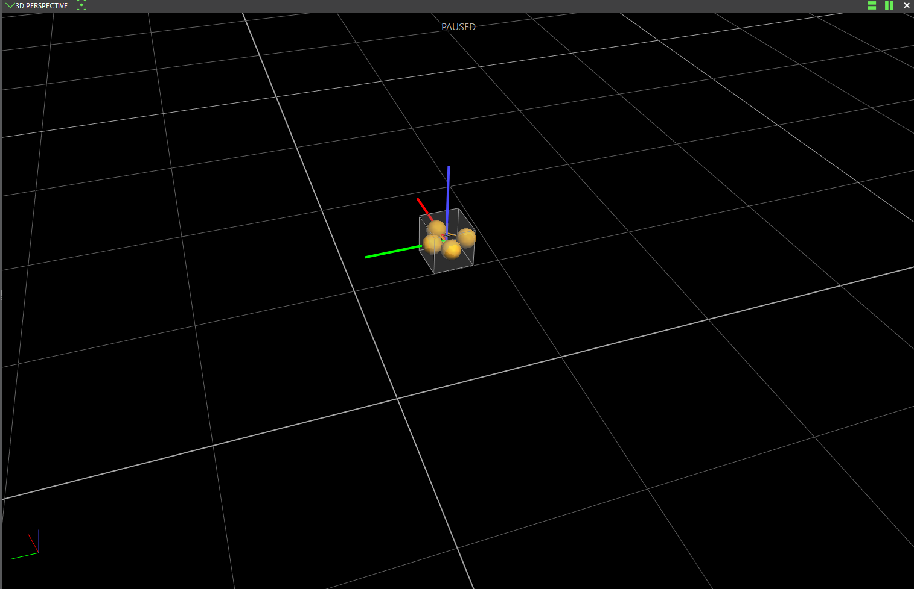

# Vicon

The Vicon motion capture system is set up in the arena to enable tracking of objects throughout the
volume. This page details the [calibration](#calibration) process, how to
[add a new object](#adding-a-new-object) and how to [get data out](#output) of Vicon.

## Background

The Vicon system works using a series of cameras that flash a set of powerful infrared LEDs. The
light from these LEDs is reflected back to the cameras by retroreflective markers, typically small
spheres. Each camera processes the image it captures and attempts to detect circles. It then sends
the centroid and radius of each detected circle over the network to the Vicon PC.

On the Vicon PC, an application called Tracker receives the centroids and radii from all the cameras
and uses them, along with knowledge of the camera positions, to calculate the 3D position of each
marker within the volume. Using knowledge of relative marker positions on a particular object,
Tracker is able to detect which object it is tracking and reconstruct the 3D pose of the object.

Reconstruction can be impaired by a number of factors:
- Occlusion: Where markers are not visible or overlap from certain orientations
- Marker size: Smaller markers are harder for Vicon to track
- Position in the volume: Certain positions are covered by fewer cameras
- Ambiguity: Where the observed pattern could come from multiple orientations

### Networking

There are some important networking points for the Vicon system. Firstly, the Vicon PC **must** have
IP address `192.168.10.1`. It then acts as a pseudo-DHCP server to set the IP addresses for the 
cameras. The cameras are set to sequenctial IP addresses following the Vicon PC: *i.e.*
`192.168.10.2`, `192.168.10.3`... Therefore, the lower range of IP addresses **must** be kept clear
as Tracker will not make any attempt to avoid other devices on the network.

## Calibration

The Vicon calibration process is simple, but can be time consuming.

### Masking

The first stage of calibration is setting the camera masks. These set regions of the image which
the cameras will not search for markers. In the Flight Arena, the masks are used to prevent the 
cameras from detecting each other and to eliminate reflections off the scaffolding used to support
them.

The masks can be automatically generated, but this requires that all markers (or spurious reflective
objects) are removed from the tracking volume. Once all objects are removed, you can check to see if
any cameras are still detecting centroids using the camera view. To do this, go to the "System" tab
and select all the cameras (Use Shift+Click). Then in the top-left of the view, choose "Cameras"
from the dropdown.


In this view, the output of the cameras can be viewed in a few ways. On the top bar, three icons are
used to configure the view. The left most controls if the greyscale output of the cameras is
displayed. This is very useful when trying to remove additional reflective objects. The centroids
seen by each camera are shown as small yellow crosses when the second icon is enabled.


Ideally, you will want no grayscale points visible throughout the image. Small grey marker balls are
very hard to spot against the carpet but they are almost certainly there. Awkwardly stepping around
the room, trying to spot when the grey point disappears has been the most reliable technique. This
is greatly sped up with the help of the Vicon Control app which allows you to view the camera
outputs on a phone.

Once the volume is free from objects and random reflective things, you can go to the "Calibrate"
tab. The first panel in this tab is "Create Camera Masks". Clicking "Start" in this panel will 
automatically paint the mask over any points that are currently grey in each camera image. You can
click "Stop" pretty soon after as this process is very quick.

### Calibration

Next is calibrating the cameras positions relative to each other. Tracker does this by having you
move a known calibration object through the volume. In the Flight Arena, we use the Vicon Active
Wand (v2). The Active Wand has a set of both red and IR LEDs that are illuminated throughout the
calibration process. See the [Active Wand](#active-wand) section below for details on use.

In the "Calibrate Cameras" panel on the "Calibrate" tab, ensure that, under "Show Advanced" the
"Wand" is set to "Active Wand v2". Then click "Start".

The (visible) LEDs on all cameras will start flashing, showing that they are gathering calibration
frames. The display on each camera will show a circle that fills in as calibration progresses.

During calibration, you should move the wand gracefully through the tracking volume. The aim is to
ensure all cameras see the wand while it is also seen by at least one other camera in a number of
different positions. Ideally the wand should be seen across the entire frame of each camera, though
this is difficult to achieve.

The calibration process should stop automatically once all cameras have captured the required number
of frames. However, this has only calibrated the cameras relative to each other. The next step is
to set the origin of the tracking volume.

### Setting the Origin

To set the origin, the Active Wand is used again. The origin in the Flight Arena is set as the
middle of the mats. Specifically, the 5th join from the left and the 3rd join up:

```
___________________________________________
|      __ __ __ __ __ __ __ __ __ __ __   |
|     |__|__|__|__|__|__|__|__|__|__|__|  |
|     |__|__|__|__|__|__|__|__|__|__|__|  |
|     |__|__|__|__|__|__|__|__|__|__|__|  |
|_    |__|__|__|__|__v__|__|__|__|__|__|  |
|_|  ³|__|__|__|__|__^__|__|__|__|__|__|  |
|  | ²|__|__|__|__|__|__|__|__|__|__|__|  |
|  | ¹|__|__|__|__|__|__|__|__|__|__|__|  |
|__|_____¹__²__³__⁴_ ⁵                    |
|____|____|____|____|          ___________|
|__      _______        ______|_____|_____|
```

To line up with historical origin settings see the pictures:


One the wand is in place, all thats needed is to click "Start" under "Set Volume Origin" on the
"Calibrate" tab.

## Adding a new object

To track a new object it will need to have markers attached to it. The background section above may
provide some useful context when considering how to distribute markers. A new object is added to be tracked on the "Objects" tab of Tracker.

### Navigating Tracker

- Orbit -> left click and drag
- Zoom -> right click and drag
- Pan -> middle click and drag

### Marker placement

While setting out the markers in an aesthetically pleasing pattern is hard to resist, it makes
the orientation of the object much more likely to be ambiguous to Tracker. Placing the markers as
randomly as possible over your object will give better results. Equally, using the biggest markers
you can get away with will improve tracking robustness.

As a caveat to that, if you are setting up a fleet of similar vehicles, it may be worth coming up
with some form of pattern to ensure that the marker distribution is distinct enough between each
vehicle. However, be *very* careful of rotational symmetry.

### Adding in Tracker

Place your object in the tracking volume. If possible, place it centred on the origin and in an
orientation where the axes match the orientation of the Vicon coordinate frame (*i.e.* x-forward).
On the "Objects" tab, in the lower left of the interface, ensure that "Object Tracking Mode" is
disabled ("Track" button appears green). You should see a visualisation of the markers that Vicon
can detect. You may need to zoom in by dragging with the right mouse button.

Ensure that Vicon can see all of the markers you have attached. If it cannot, you may need to adjust
your marker positions if possible to reduce occlusion from the object. Select the markers that correspond with your object using Control+Left click. Then in the lower left again, give your object
a name under the "Create Object" field. Click "Create" and your object will be added to Tracker.

By default Tracker will set the object origin as the mean position of the selected markers and the
object origin's orientation will match the Vicon coordinate system orientation. The object origin
will be the point which is reported in the Vicon output. For aerial vehicles you will typically want
to adjust this point to match the centre of gravity, to minimise the effect of rotation on the
reported position.

The position of the object origin can be fine tuned by pausing tracking with the Spacebar. The
object origin axes will become bold and you will be able to drag them to set the object origin
relative to the marker positions. The object axes will snap to the gridlines in the main Vicon
frame. This can be used to your advantage by positioning your vehicle centre of gravity above the
origin. This will make it easy to line up the object origin.



The object origin orientation can be set in a similar fashion. While paused, clicking on any of the
linear axes will bring up a set of hoops that can be dragged to set the orientation of the object
origin. As with the linear axes, the values will snap to the main Vicon coordinate frame.


*NB: Tracking towards the ground can sometimes be limited, so it may help to raise your object up,
especially if you are using small markers.*

### Recalibrating

In the event of a crash, or just through ground handling, markers can become displaced. If enough of
your markers are unharmed, and you're able to replace the displaced marker close enough, you can
usually just recalibrate the marker instead of recreating the object.

## Output

Typically, you will want to get the output of Vicon for use in your own code. This can be done in a
number of ways. The most commonly used in the lab is Tracker's UDP output. Tracker also supports TCP
output and now has an offical Python API.

The output will be relative to the tracking volume origin. This origin is set during calibration but
you can expect it to be approximately in the middle of the mats. The x-axis of the coordinate frame
towards the far wall, away from the desks across the short axis of the arena. The y-axis is from
right to left looking from behind the desks. To complete the right-hand coordinate system, the
z-axis is upwards.

```
_________________________________
|                                |
|                ^               |
|                |x              |
|_            <--                |
|_|            y                 
|  |                             |
|__|____________                 |
|___|___|___|___|                |
|                     _____ _____|
|_    _____    ______|_____|_____|
```

### UDP Output

Tracker can output a UDP stream that contains the position and orientation of each tracked object.
The stream is in a binary format that is documented towards the end of the Vicon Tracker User Guide.
The guide is available to download from [docs.vicon.com](https://docs.vicon.com/display/Tracker39/PDF+downloads+for+Vicon+Tracker).

The [vicon_udp](https://github.com/UoBFlightLab/vicon_udp) GitHub repository contains C++ code for
both ROS and ROS2 nodes that listen to the Vicon UDP stream. Versions are also  available for
[Rust](https://github.com/rob-clarke/vicon_rs) with a Python version pending.

The output translation is in millimetres, while the rotation is Tait-Bryan angles in XYZ order. Note
that this is not the typical aerospace order of yaw, pitch, roll and so may require conversion.

#### Enabling the output

*In the Flight Arena, the UDP stream will typically be enabled by default so this should not be
needed.*

TODO

## Active Wand

The Active Wand has an internal battery that needs charging prior to use. There are two switches
on the wand, one is the on-off switch, and the other selects between continuous and strobe mode. 
Either mode should work to calibrate the system, but the lab has typically used continuous mode.

## Troubleshooting

### Vicon cannot find the cameras

Sometimes after a Windows update or if the arena network has been changed or adjusted, the Vicon Tracker machine cannot find the cameras on the network. From experience, this maybe due to the firewall blocking traffic between the computer and the cameras. By default, the firewall only allows traffic to Vicon if the Vicon traffic is on a **private** network. Sometimes updates or network changes (for some unknown reason) cause the flight arena network to change to public or undefined. 

Finding a way to set the network back to private (either through the gui or through elevated powershell) will hopefully solve these problems. 
